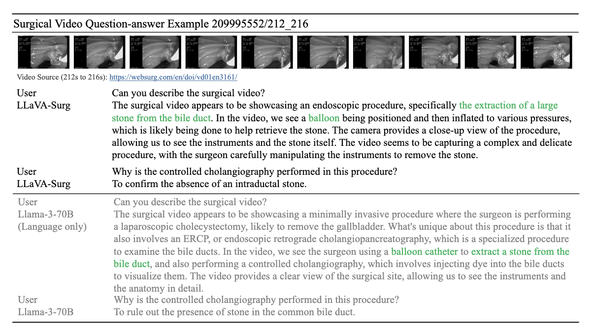
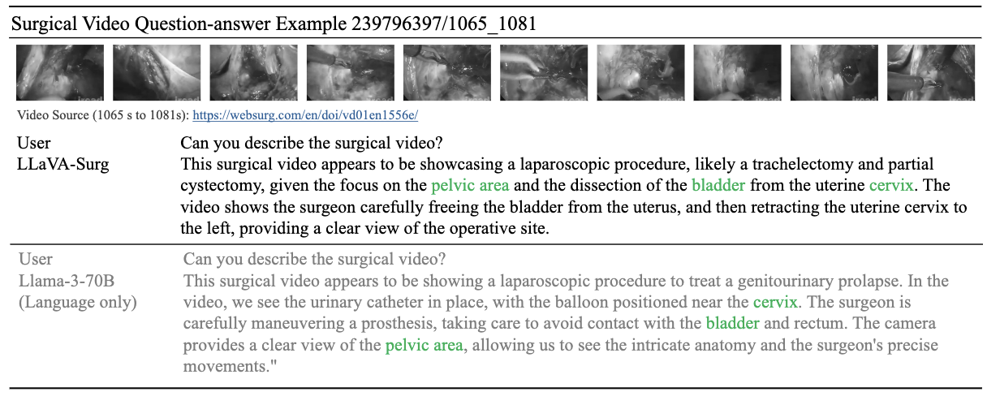

# LLaVA-Surg: Towards Multimodal Surgical Assistant via Structured Surgical Video Learning

This is code for Paper [LLaVA-Surg: Towards Multimodal Surgical Assistant via Structured Surgical Video Learning](https://arxiv.org/abs/2408.07981). We will release the full code soon.


## Contents

- [Data Download](#data-download)
- [Data Generation](#data-generation)
- [Related Projects](#related-projects)


## Data Generation
See INSTRUCT/README.md.


## Qualitative Analysis






## LICENSE
[](https://creativecommons.org/licenses/by-nc/4.0/deed.en)
[](https://creativecommons.org/licenses/by-nc/4.0/deed.en)
The data, code, and model checkpoints are intended and licensed for research use only. They are also subject to additional restrictions dictated by the Terms of Use: LLaMA, WebSurg. The instruction tunning data is made available under CC BY NC 4.0. The data, code, and model checkpoints may be used for non-commercial purposes and any models trained using the dataset should be used only for research purposes. It is expressly prohibited for models trained on this data to be used in clinical care or for any clinical decision making purposes.


## Acknowledgement

If you find LLaVA-Surg useful for your your research and applications, please cite using this BibTeX:

```bibtex
@article{li2024llava,
  title={LLaVA-Surg: Towards Multimodal Surgical Assistant via Structured Surgical Video Learning},
  author={Li, Jiajie and Skinner, Garrett and Yang, Gene and Quaranto, Brian R and Schwaitzberg, Steven D and Kim, Peter CW and Xiong, Jinjun},
  journal={arXiv preprint arXiv:2408.07981},
  year={2024}
}
```